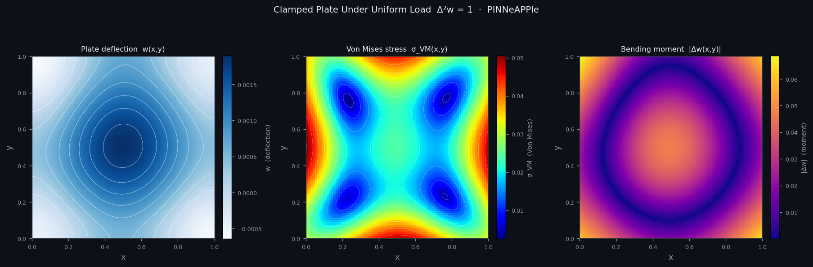

# PINNeAPPle 🍍
### Your Physics AI Laboratory — from first principles to real-world systems

> *Experiment. Learn. Build. Then scale — anywhere.*

PINNeAPPle is an open-source **Physics AI research and experimentation platform** designed to take you from your first physics-informed neural network all the way to **robust, production-ready solutions** — independent of any specific framework, vendor, or ecosystem.

<div align="center">

| | |
|:---:|:---:|
|  |  |
| *Clamped Plate — deflection, Von Mises stress & bending moment* | *2D Heat Equation — Exact vs PINN across time steps* |
|  |  |
| *Lamb-Oseen Vortex Pair — vorticity evolution* | *Allen-Cahn Phase Separation — interface dynamics* |

</div>

---

## 🚀 Why PINNeAPPle?

Modern Physics AI ecosystems are powerful — but they assume you already understand:

- How to formulate physical problems correctly
- Which architectures to use (PINNs, operators, surrogates…)
- How to validate physics consistency
- How to benchmark and trust your results

**PINNeAPPle is where you build that foundation.**

Think of it as your experimentation layer:

```
Your physics problem
        ↓
  [ PINNeAPPle ]   ← experiment freely here
    Understand the physics
    Try architectures
    Compare approaches
    Validate results
    Build intuition
        ↓
[ Your Target Stack ]
  (custom infra, HPC, cloud, internal platform, etc.)
  Scale, deploy, integrate
```

---

## 🧠 Three Tiers of Physics AI Experience

### 🌱 Tier 1 — Explorer
> *"I understand the physics. I want to see what AI can do with it."*

```python
from pinneaple_environment import BurgersPreset

problem = BurgersPreset(nu=0.01)
model   = problem.build_model()
trainer = problem.build_trainer(n_epochs=3000)
result  = trainer.fit(model)
result.plot()
```

---

### 🔬 Tier 2 — Experimenter
> *"I want to test ideas and compare approaches."*

```python
from pinneaple_arena import ArenaRunner

runner  = ArenaRunner.from_yaml("configs/arena/burgers_benchmark.yaml")
results = runner.run_all()
results.leaderboard()
```

<div align="center">


*Potential Flow Past Circular Cylinder — exact solution vs PINN vs pointwise error*

</div>

---

### 🚀 Tier 3 — Builder
> *"I want to turn this into a real system."*

```python
from pinneaple_train.distributed import DDPPINNTrainer
from pinneaple_export.onnx_exporter import ONNXExporter
```

<div align="center">


*Multi-model forecast comparison across test windows — Naive, FFT-only, LSTM, FFT+LSTM*

</div>

---

## 🌍 The Bridge to Any Physics AI Stack

PINNeAPPle is **stack-agnostic**.

It helps you:

1. Validate physics and modeling
2. Benchmark architectures
3. Export models
4. Integrate with:
   - HPC clusters
   - Cloud ML pipelines
   - Simulation frameworks
   - Internal platforms
   - Digital twins

---

## 🔥 Key Features

| Module | Description |
|--------|-------------|
| 📦 **Unified Physical Data (UPD)** | State, geometry, equations, metadata |
| 🌍 **Data Pipeline** | Zarr datasets, active learning |
| 📐 **Geometry & Mesh** | CAD, meshing, simulation interoperability |
| 🧠 **Model Zoo** | PINNs, Neural Operators, GNNs, Transformers, ROM, Classical |
| 🧮 **Physics Loss Factory** | Symbolic PDE → residuals |
| ⚙️ **Solvers** | FEM, FDM, FVM, Spectral, SPH, LBM |
| 🏗️ **Training** | Distributed, AMP, deterministic |
| 📊 **Uncertainty & Validation** | Dropout, ensembles, conservation checks |
| 🔁 **Transfer & Meta-Learning** | Fine-tuning, cross-PDE adaptation |
| 🛰️ **Digital Twins** | EnKF, real-time estimation |
| 🚢 **Deployment** | FastAPI, ONNX, TorchScript |
| 🤖 **Problem Design** | NLP → PDE |
| 🏆 **Benchmarking** | YAML, leaderboards |

---

## 🎯 Philosophy

> *If you can't validate it, you shouldn't deploy it.*

Physics AI is about:

- ✅ Correct formulations
- ✅ Reliable validation
- ✅ Understanding failure modes
- ✅ Making informed decisions

---

## 🧠 Positioning

|  | PINNeAPPle |
|--|------------|
| Vendor lock-in | ❌ Not tied to any vendor |
| Just a PINN library | ❌ Much more than that |
| Just experimentation | ❌ Bridges to production |
| ✅ What it is | A controlled environment to **design, test, and validate** Physics AI systems |

---

## ⭐ Support the Project

If this project makes sense to you, **give it a star** ⭐

It helps:

- Grow the ecosystem
- Attract contributors
- Build a real standard

---

*Built for researchers and engineers who take physics seriously.*